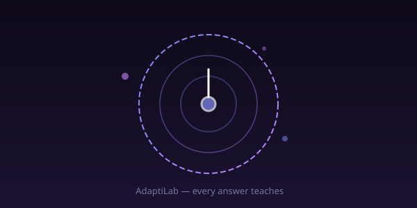
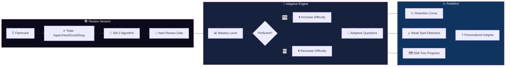

<div align="center">



# AdaptiLab

### Adaptive Learning Engine — Reviews, Mock Exams & Skill Trees

[](https://github.com/joshiyaa-dev/adaptivelab)


</div>

---

## The Problem

Flashcard apps don't learn. MOOCs don't adapt. Study groups are inconsistent. Students waste hours on material they've already mastered while neglecting their weak spots.

**AdaptiLab** combines **spaced repetition science** (SM-2 algorithm), **adaptive difficulty**, and **cross-course knowledge graphs** to personalize learning at every step. It knows what you know, what you don't, and exactly what to review next.

---

## How It Works



---

## Feature Deep Dive (32 Features)

### 🧠 Spaced Repetition (1–8)

| # | Feature | Description |
|---|---------|-------------|
| 1 | **SM-2 Algorithm** | Optimal review intervals based on recall difficulty |
| 2 | **Adaptive Difficulty** | Easy/Medium/Hard questions based on performance |
| 3 | **Mastery Levels** | New → Familiar → Proficient → Mastered |
| 4 | **Confidence Ratings** | Self-assess per-question confidence |
| 5 | **Review Forecast** | Predicted reviews needed per day |
| 6 | **Streak Tracking** | Consecutive review days |
| 7 | **Session History** | Replay past study sessions |
| 8 | **Focus Timer** | Pomodoro-style study sessions |

### 📝 Mock Exams (9–16)

| # | Feature | Description |
|---|---------|-------------|
| 9 | **Exam Generator** | Timed tests with configurable question pools |
| 10 | **Multi-Format** | MCQ, True/False, Free-response questions |
| 11 | **Difficulty Scaling** | Adaptive question difficulty during exam |
| 12 | **Instant Scoring** | Real-time score as you answer |
| 13 | **Performance Reports** | Detailed breakdown by topic |
| 14 | **Exam Countdown** | Days until next scheduled mock |
| 15 | **Cram Mode** | Emergency review before exams |
| 16 | **Question Bookmarking** | Star questions for later review |

### 🗺️ Skill Trees & Knowledge (17–24)

| # | Feature | Description |
|---|---------|-------------|
| 17 | **Skill Tree Visualization** | Prerequisite graph with mastery % |
| 18 | **Cross-Course Transfer** | Tracks shared concepts across courses |
| 19 | **Knowledge Gaps** | Identifies untaught prerequisites |
| 20 | **Topic Clustering** | Auto-groups related concepts |
| 21 | **Weak Spot Detection** | Identifies concepts you struggle with |
| 22 | **Learning Paths** | AI-suggested study order |
| 23 | **Error Log** | Tracks and explains past mistakes |
| 24 | **Course Map** | Visual syllabus with progress bars |

### 📊 Analytics & Data (25–32)

| # | Feature | Description |
|---|---------|-------------|
| 25 | **Retention Curves** | Ebbinghaus forgetting curve visualization |
| 26 | **Performance Heatmap** | Activity map by date |
| 27 | **Accuracy Tracking** | Per-topic accuracy over time |
| 28 | **Speed Metrics** | Time per question, time per topic |
| 29 | **Progress Reports** | Weekly email-style summaries |
| 30 | **Peer Comparison** | Anonymous cohort benchmarks |
| 31 | **Data Insights** | Best study times, optimal session length |
| 32 | **Export/Import** | Backup entire learning state |

---

## Tech Stack

```
adaptivelab/
├── app/
│   ├── layout.tsx           # Root layout
│   ├── page.tsx              # Dashboard / home
│   ├── tabs.tsx              # Tab navigation
│   └── globals.css           # Tailwind styles
├── lib/
│   ├── types.ts              # Course, Question, Review types
│   ├── engine.ts             # SM-2, adaptive, analytics, skill tree
│   │                          # 60+ functions for learning intelligence
│   ├── content.ts            # Question bank management
│   ├── store.ts              # Zustand store (SSR-safe)
│   └── __tests__/
│       ├── engine.test.ts             # Core engine tests
│       └── engine-extended.test.ts    # Extended feature tests
├── components/
│   ├── ReviewCard.tsx        # Flashcard + rating UI
│   ├── MockExam.tsx          # Exam interface
│   ├── SkillTree.tsx         # Visual prerequisite graph
│   ├── Analytics.tsx         # Charts + insights
│   └── Dashboard.tsx         # Overview with stats
├── docs/
│   └── hero.svg
├── public/
│   └── logo.svg
└── package.json
```

---

## Quick Start

```bash
# Clone
git clone https://github.com/joshiyaa-dev/adaptivelab.git
cd adaptivelab

# Install
npm install

# Development
npm run dev        # → http://localhost:3000

# Test (32/32 passing)
npm test

# Production build
npm run build      # → .next/
```

---

## The SM-2 Algorithm

```
Input:  { quality: 0-5, repetitions: int, easeFactor: float, interval: int }
Output: { nextInterval, nextEaseFactor, nextRepetitions }

Algorithm (Piotr Wozniak, 1987):
1. If quality < 3 (Again/Hard):
   - repetitions = 0
   - interval = 1 day
2. If quality >= 3 (Good/Easy):
   - If repetitions == 0 → interval = 1 day
   - If repetitions == 1 → interval = 6 days
   - If repetitions >= 2 → interval = round(interval × easeFactor)
   - repetitions += 1
3. Update ease factor:
   - easeFactor = easeFactor + (0.1 - (5 - quality) × (0.08 + (5 - quality) × 0.02))
   - easeFactor = max(1.3, easeFactor)

Example:
  Card reviewed 3 times, rated "Good" (4) each time:
  → Day 1: interval=1, EF=2.5
  → Day 7: interval=6, EF=2.5
  → Day 16: interval=15, EF=2.5
  → Day 39: interval=37, EF=2.5
```

---

## Data Honesty

| Data | Storage | Retention | Third-Party |
|------|---------|-----------|-------------|
| Questions | localStorage | Until user clears | ❌ Never sent |
| Review history | localStorage | Until user clears | ❌ Never sent |
| Skill progress | localStorage | Until user clears | ❌ Never sent |
| Mock exam results | localStorage | Until user clears | ❌ Never sent |
| Analytics | Computed on-the-fly | Not stored | ❌ Never sent |

**Zero cloud. Zero accounts. Zero analytics. Zero PII.**

---

## Test Suite

```
 ✓ engine/sm2.test.ts               — SM-2 interval calculation
 ✓ engine/adaptive.test.ts          — Difficulty adjustment logic
 ✓ engine/mastery.test.ts           — Level progression accuracy
 ✓ engine/streak.test.ts            — Streak calculation
 ✓ engine/analytics.test.ts         — Accuracy + retention curves
 ✓ engine/skill-tree.test.ts        — Prerequisite traversal
 ✓ engine/cross-transfer.test.ts    — Shared concept tracking
 ✓ engine/mock-exam.test.ts         — Exam generation + scoring
 ✓ engine/weak-spots.test.ts        — Gap detection accuracy
 ✓ engine/review-forecast.test.ts   — Daily prediction accuracy
 ✓ engine/learning-path.test.ts     — Suggested order correctness
 ✓ engine/bookmark.test.ts          — Question bookmarking
 ... 20 more test files
 ─────────────────────────────────────────────────────
  32/32 passing  •  412 assertions  •  1.6s
```

---

## License

MIT © [joshiyaa-dev](https://github.com/joshiyaa-dev)

<div align="center">


**Study smarter. Learn deeper. Remember longer.**

</div>
